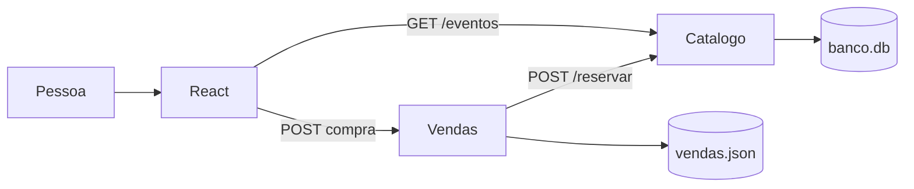
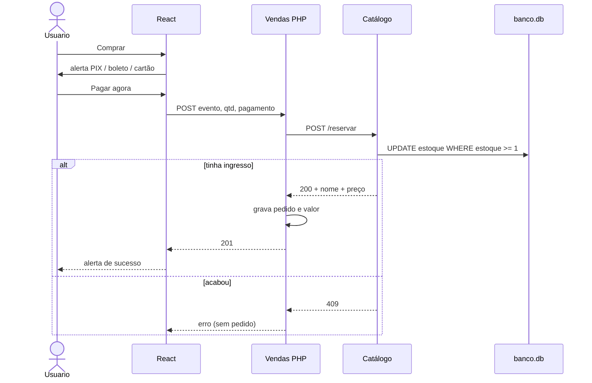
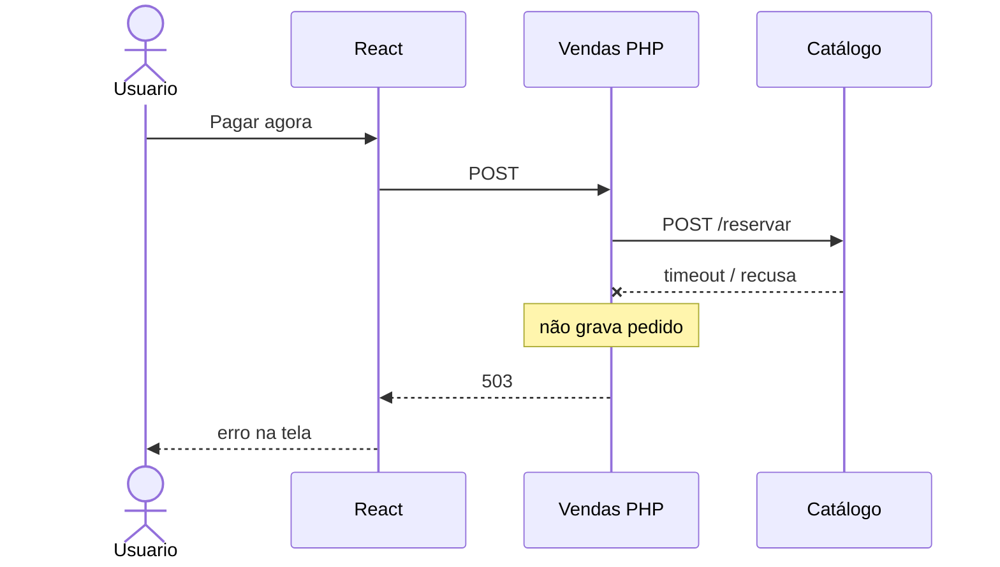

# IngressoCerto

Resposta ao teste, na ordem do enunciado.

[Diagrama no Excalidraw](https://excalidraw.com/#json=ojOmlmuhs7Ehk73BnMhAW,WuXzVFgwFLqSmQqf9lYxqw)

---

## 1. Introdução e cenário

Três serviços independentes:

| Pasta | Stack | Papel no enunciado |
| --- | --- | --- |
| `frontend/` | React + Vite + Tailwind | Tela: vê eventos e compra |
| `catalogo/` | Python (Flask) + SQLite | Shows e estoque |
| `vendas/` | PHP | Processa compra, pagamento e pedido |

O que o enunciado pede no clique:

1. A requisição vai para o **PHP** (não para o Python).
2. O PHP pergunta o estoque no **Catálogo**.
3. Só então o pedido é confirmado.

Como garanto isso:

- **Consistente:** o Python baixa estoque com `UPDATE ... WHERE estoque >= 1`. Dois no último ingresso: um passa, o outro toma `409`. Sem pedido fantasma.
- **Não vende além do estoque:** o PHP só grava se o `/reservar` voltar `200`.
- **Simples de manter:** cada um tem um papel. React não chama `/reservar`.

---

## 2. Arquitetura e solução

### Parte 1 – Visão geral

Dois bancos. Estoque no Python. Pedido no PHP.

```
                 GET /eventos
Pessoa → React ──────────────────────────► Catálogo (Python)
            │                                    │
            │ POST compra                        │
            ▼                                    ▼
      Vendas (PHP) ── POST /reservar ──►    banco.db
            │                               (estoque)
            ▼
     vendas.json
      (pedidos)
```



- `GET /eventos` — lista show, estoque e preço. Só leitura.
- `POST /reservar` — baixa ingresso. Só o PHP chama.
- Pedido em `vendas.json` (nesta máquina o PHP não tem `pdo_sqlite`; o desenho é SQLite/MySQL).

### Parte 2 – Comunicação (compra completa)

É **síncrono**. A pessoa precisa saber na hora se o lugar é dela. O PHP chama o Python e espera (timeout 5s).

1. Clica em **Comprar**. Ainda **não** vende. Abre PIX / boleto / cartão.
2. Clica em **Pagar agora**. POST só no PHP (`evento_id`, `quantidade`, `pagamento`).
3. PHP → `POST /reservar` no Python e espera.
4. Python baixa estoque na query. Sem estoque → `409`, PHP **não** grava.
5. Deu certo → PHP grava pedido com valor e forma → React mostra o alerta verde.



**Síncrono — vantagem:** simples, resposta na hora, só confirma se o estoque baixou.  
**Síncrono — desvantagem:** se o Python atrasar, o usuário espera.  
Fila eu usaria para e-mail, não para confirmar ingresso. Ingresso não pode ficar “talvez”.

### Parte 3 – Catálogo indisponível

O enunciado diz “catálogo (PHP)”. O estoque é **Python**. Se ele cair:

- o PHP **não** grava venda
- responde **503**
- o React mostra para tentar de novo (estado de erro)

Não vendo “na confiança”. Sem estoque confirmado, não existe pedido.



---

## 3. Implementação

O enunciado pede parte do código, não o sistema inteiro. O que pediu está nestes arquivos.

### Parte 1 – Backend (PHP → Python)

`vendas/VendaController.php` → `comprar($eventoId, $quantidade, $pagamento)`

- POST HTTP no Catálogo (`/reservar`)
- `200` → grava no banco local (`vendas.json`)
- falha de rede → `503`, sem venda
- estoque acabou → `409`, sem venda

Pagamento entra porque o enunciado pede validar pagamento antes de confirmar. Sem `pix` / `boleto` / `cartao`, nem chama o Python.

### Parte 2 – Frontend (React)

`frontend/BotaoComprar.jsx`

- botão **Comprar**
- chama a API do PHP (não o `/reservar`)
- **Carregando** enquanto espera
- **Erro** se a API falhar (`409`, `503`, rede)

---

## 4. Perguntas finais

### Documentação

O frontend precisa saber exatamente o que mandar. Por isso o Swagger: [http://127.0.0.1:5000/docs](http://127.0.0.1:5000/docs).

Lá: URL, campo, tipo, exemplo e erro. Sem isso, um manda texto, outro manda número, a API quebra.

O React usa duas rotas: listar eventos e comprar. Reservar estoque é interno. O time de tela não mexe nisso.

Por quê: contrato evita chute. `/reservar` interno reduz erro e furo de segurança.

### Segurança

Ninguém pode baixar estoque sem pagar.

Se `/reservar` ficar pública, qualquer um tira ingresso no Postman e a empresa não recebe.

Por isso o React não chama o Python. Ele chama o PHP, depois que a pessoa escolhe PIX, boleto ou cartão.

Dados separados: tela no React, pedido no PHP, estoque no Python.

Hoje isso é o desenho da demo. Em produção: Catálogo na rede interna, chave entre PHP e Python, HTTPS, CORS só do site, pagamento confirmado no gateway. O React nunca recebe essa chave.

### Escalabilidade

Milhares ao mesmo tempo: quem mais sofre é o Catálogo. O estoque é um número só.

Por quê: cada venda precisa atualizar esse número. Não dá para ter duas verdades. Vários PHP ao mesmo tempo todos batem no mesmo estoque.

O PHP eu coloco mais de um, atrás de um balanceador. A página eu coloco em cache.

Por quê: o caixa não guarda o estoque. Só recebe o pedido e chama o Catálogo. Mais PHP = mais gente no caixa. A lista de eventos muda pouco, então a página pode ir no cache. O estoque, não.

O que eu **não** coloco em cache é o estoque na hora de vender. Senão vendo ingresso que não existe.

Por quê: cache é cópia atrasada. A tela pode mostrar 5. No banco já é 0. Se eu vender com o número da tela, vendo o que não tem.

Quem chegar depois do último lugar ouve esgotou. Isso é certo.

Por quê: o show tem 100 cadeiras, não 101. O `409` não é falha. É a regra.

### Extra

Se uma função está lenta, eu não saio mudando no achismo. Primeiro eu meço onde trava.

Pode ser query, pode ser rede, pode ser lock.

Aí sim eu corrijo.

Se o travamento for o último ingresso, eu não tiro essa trava. Duas pessoas não podem ficar com o mesmo lugar.

Por quê: Redis no escuro mascara o problema. Lock no último ingresso é regra, não bug.

---

## Como rodar (demo)

Três terminais. Ordem: Catálogo → Vendas → tela.

**Catálogo** (porta 5000)

```bash
cd catalogo
python3 -m venv .venv
source .venv/bin/activate
pip install -r requirements.txt
python app.py
```

**Vendas** (porta 8000)

```bash
cd vendas
php -S 127.0.0.1:8000
```

**Frontend** (porta 5173)

```bash
cd frontend
npm install
npm run dev
```

Abre [http://127.0.0.1:5173](http://127.0.0.1:5173).  
Swagger: [http://127.0.0.1:5000/docs](http://127.0.0.1:5000/docs).

---

## APIs (o que o frontend manda)

O frontend **só precisa** da lista e da compra. `POST /reservar` é interno.

### GET `http://127.0.0.1:5000/eventos`

```json
[ { "id": 1, "nome": "Show do Silva", "estoque": 50, "preco": 180 } ]
```

### POST `http://127.0.0.1:8000/index.php`

```json
{ "evento_id": 1, "quantidade": 1, "pagamento": "pix" }
```

`pagamento`: `pix`, `boleto` ou `cartao`.

| HTTP | Quando |
| --- | --- |
| 201 | Pedido gravado |
| 400 | Campo faltando ou pagamento inválido |
| 409 | Estoque insuficiente |
| 503 | Catálogo fora (não grava venda) |
