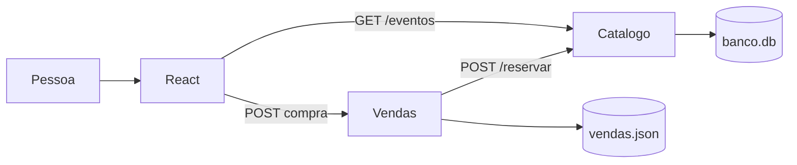
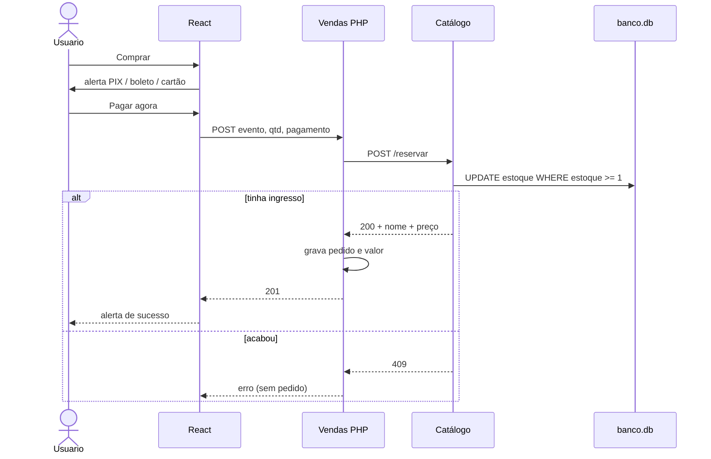
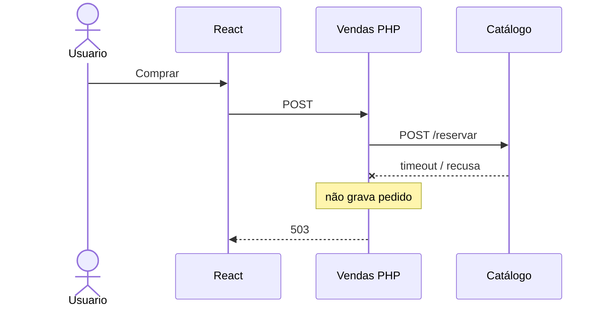

# IngressoCerto

Venda simples de ingressos. Três serviços separados, como o desafio pediu:

| Pasta | Stack | Papel |
| --- | --- | --- |
| `frontend/` | React + Vite + Tailwind | Tela: lista os shows e o botão comprar |
| `vendas/` | PHP | Caixa: recebe a compra, reserva no catálogo, grava o pedido |
| `catalogo/` | Python (Flask) | Estoque: eventos e quantidade disponível |

A compra **não** fala com o Catálogo direto. O React chama o PHP. O PHP chama o Python. Só grava venda se a reserva der certo.

## Diagrama

[Abrir no Excalidraw](https://excalidraw.com/#json=ojOmlmuhs7Ehk73BnMhAW,WuXzVFgwFLqSmQqf9lYxqw)


---

## Como rodar

Três terminais. Ordem: Catálogo → Vendas → tela.

**Catálogo** (porta 5000)

```bash
cd catalogo
python3 -m venv .venv
source .venv/bin/activate
pip install -r requirements.txt
python app.py
```

**Vendas** (porta 8000)

```bash
cd vendas
php -S 127.0.0.1:8000
```

**Frontend** (porta 5173)

```bash
cd frontend
npm install
npm run dev
```

Abre [http://127.0.0.1:5173](http://127.0.0.1:5173).

Documentação das APIs (Swagger): [http://127.0.0.1:5000/docs](http://127.0.0.1:5000/docs).

O PHP desta máquina não tinha `pdo_sqlite`, então o pedido vai para `vendas/vendas.json`. O estoque continua no SQLite do Catálogo (`catalogo/banco.db`).

---

## Arquitetura

Dois bancos. Estoque no Python. Pedido no PHP.

```
                 GET /eventos
Pessoa → React ──────────────────────────► Catálogo (Python)
            │                                    │
            │ POST compra                        │
            ▼                                    ▼
      Vendas (PHP) ── POST /reservar ──►    banco.db
            │                               (estoque)
            ▼
     vendas.json
      (pedidos)
```



- `GET /eventos` lista show, estoque e **preço**. Só leitura.
- `POST /reservar` baixa ingresso com um `UPDATE ... WHERE estoque >= 1`. Dois cliques no último lugar: um passa, o outro toma 409.
- O React nunca chama `/reservar`.
- A compra só segue depois do alerta de pagamento: PIX, boleto ou cartão.

---

## Fluxo da compra (explicação simples)

A pessoa está na tela. Ela precisa saber **agora** se o lugar é dela. Por isso a compra é **síncrona**: o PHP chama o Python e espera.

1. Clica em **Comprar**. Ainda **não** vende. Abre o alerta: PIX, boleto ou cartão, com o preço.
2. Clica em **Pagar agora**. O React manda um POST **só para o PHP** (evento, quantidade 1, forma de pagamento).
3. O PHP chama o Python em `/reservar` e espera.
4. O Python baixa o estoque numa query só (`estoque >= 1`). Dois cliques no último ingresso: um passa, o outro toma 409.
5. Se deu certo, o PHP grava o pedido com **valor** e **forma**. Se acabou o estoque, **não** grava.
6. A tela mostra o alerta verde (show, valor real, PIX/boleto/cartão, número do pedido) e o estoque no card desce.

Clicar não vende. Pagar vende. Quem confirma estoque é o Python. Quem grava o negócio é o PHP.



**Síncrono:** simples, resposta na hora, só confirma se o estoque baixou.  
**Contra:** se o Python atrasar, o usuário espera. Fila eu usaria para e-mail, não para confirmar ingresso.

---

## APIs

O frontend **só precisa** da lista de eventos e da compra. Reservar estoque é interno (PHP → Python).

### GET `http://127.0.0.1:5000/eventos`

Lista os shows. Sem corpo.

Resposta `200`:

```json
[
  { "id": 1, "nome": "Show do Silva", "estoque": 50, "preco": 180 }
]
```

| Campo | Tipo | O que é |
| --- | --- | --- |
| `id` | número | ID do evento |
| `nome` | texto | Nome do show |
| `estoque` | número | Quantos ainda tem |
| `preco` | número | Valor de 1 ingresso (R$) |

### POST `http://127.0.0.1:8000/index.php`

Compra. O React manda JSON.

Enviar:

```json
{
  "evento_id": 1,
  "quantidade": 1,
  "pagamento": "pix"
}
```

| Campo | Tipo | Obrigatório | Valores |
| --- | --- | --- | --- |
| `evento_id` | número | sim | ID que veio do GET |
| `quantidade` | número | sim | 1 ou mais |
| `pagamento` | texto | sim | `pix`, `boleto` ou `cartao` |

Resposta `201` (deu certo):

```json
{
  "ok": true,
  "venda_id": 19,
  "evento_id": 1,
  "nome": "Show do Silva",
  "quantidade": 1,
  "preco": 180,
  "total": 180,
  "pagamento": "pix",
  "pagamento_nome": "PIX"
}
```

Erros:

| HTTP | Quando |
| --- | --- |
| 400 | Faltou campo ou pagamento inválido |
| 409 | Estoque insuficiente |
| 503 | Catálogo fora do ar (não grava venda) |

`POST /reservar` no Python **não** é API de frontend. Só o PHP chama.

---

## Perguntas do desafio

Cada resposta em três partes: o que eu faria, por quê, e a frase para falar.

### 1. Documentação

**Pergunta:** sendo backend, como o frontend sabe o que enviar?

**Resposta:** um contrato da API. URL, método, campos, tipo, exemplo e o que significa cada erro.

**Por quê.** Se eu só falo “manda o evento”, um manda `"1"` em texto, outro manda `1` em número, outro manda `PIX` em maiúsculo. A API quebra e cada um culpa o outro.

**Neste projeto.** O frontend usa duas coisas:

1. `GET /eventos` — lista `id`, `nome`, `estoque`, `preco`
2. `POST` no PHP — manda `evento_id` (número), `quantidade` (número), `pagamento` (`pix`, `boleto` ou `cartao`)

O `/reservar` do Python **não** entra nesse contrato. É chamada interna.

**Como eu falo:**  
“O contrato já está no Swagger em `/docs`. URL, campos, tipos, exemplo e erros 400, 409 e 503. O time de tela só usa GET de eventos e POST de compra. `/reservar` aparece marcado como interno.”

---

### 2. Segurança

**Pergunta:** como ninguém reserva estoque sem pagar? Como os dados ficam separados?

**Resposta:** quem baixa estoque é o PHP, depois que a pessoa escolheu pagar. O React não tem acesso à rota de reservar. Cada serviço guarda só o que é dele.

**Por quê.** Se o `/reservar` ficar público, qualquer um baixa ingresso no Postman, sem PIX, sem boleto, sem cartão. O show some e a empresa não recebeu nada.

**Neste projeto.**

- A tela chama **só** o PHP, e só depois do alerta de pagamento.
- Sem `pagamento` válido (`pix`, `boleto`, `cartao`), o PHP nem chama o Python.
- O Catálogo fica interno. Em produção eu colocaria chave entre PHP e Python.
- **Camadas:** Catálogo = estoque e preço. PHP = pedido, valor, forma. React = tela. Número de cartão de verdade não entra aqui; a demo só registra a escolha.

**Como eu falo:**  
“O frontend nunca baixa estoque. Quem baixa é o caixa, que também registra o pagamento. Estoque num banco, pedido no outro. Assim ninguém reserva ingresso no escuro.”

---

### 3. Escalabilidade

**Pergunta:** milhares de pessoas no mesmo segundo. Quem sofre? O que eu faria?

**Resposta:** o **Catálogo** sofre mais, porque todo mundo disputa o **mesmo** número de estoque. O PHP sofre em seguida, porque cada clique vira um pedido. A vitrine é a mais fácil de aguentar.

**Por quê.** Posso ter 20 caixas (vários PHP). Não posso ter 20 verdades de estoque. O último ingresso é um ponto só.

**O que eu faria.**

- Vários PHP atrás de um load balancer (o caixa replica).
- Catálogo continua com o `UPDATE` atômico. **Não** coloco estoque em cache na hora de vender. Cache serve para ler nome e preço na vitrine.
- Limite de clique repetido no botão / no IP.
- Aceitar que no último ingresso parte das pessoas vai ouvir “esgotou”. Isso não é falha; é o sistema honesto.

**Como eu falo:**  
“O gargalo natural é o estoque. Eu escalo o PHP fácil. No Catálogo eu protejo o número, não escondo ele num cache. Quem chegar depois do último lugar recebe 409.”

---

### 4. Extra — gargalo no backend

**Pergunta:** uma função está lenta. Eu já tenho uma ideia. Como eu faria?

**Resposta:** primeiro **meço**. Depois mudo. Sugestão sem dado é opinião.

**Por quê.** O problema pode ser query, lock, chamada HTTP, loop, disco. Se eu “já coloco Redis” no escuro, posso mascarar o erro ou gastar tempo no lugar errado.

**Como eu faria.**

1. Olho o tempo: log, APM, `EXPLAIN` no SQL, profiler.
2. Acho a causa: N+1, índice faltando, timeout no Python, lock no último ingresso.
3. Só então: índice, cache de **leitura**, pool de conexão, menos ida e volta.

Se o gargalo for o `UPDATE` do último ingresso, **não é bug**. Duas pessoas não podem levar o mesmo lugar. Aí a melhoria é fila na **entrada** (página do evento), não vender sem olhar o estoque.

**Como eu falo:**  
“Eu meço, acho a causa, aí aplico a melhoria. No último ingresso, lentidão de lock é o preço da consistência. Eu não tiro isso para ‘ficar mais rápido’ e superlotar o show.”

---

## Se o Catálogo cair

No enunciado aparece “catálogo (PHP)”. O estoque é **Python**. Se ele estiver fora:

- o PHP não grava venda
- responde **503**
- o React mostra para tentar de novo

Não vendo “na confiança”. Sem estoque confirmado, não existe pedido.



---

## Pastas

```
catalogo/    API Flask + banco.db
vendas/      API PHP + vendas.json
frontend/    React
```
