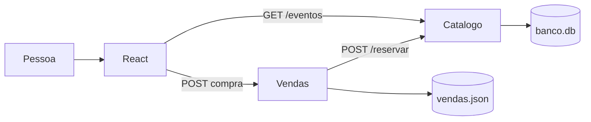
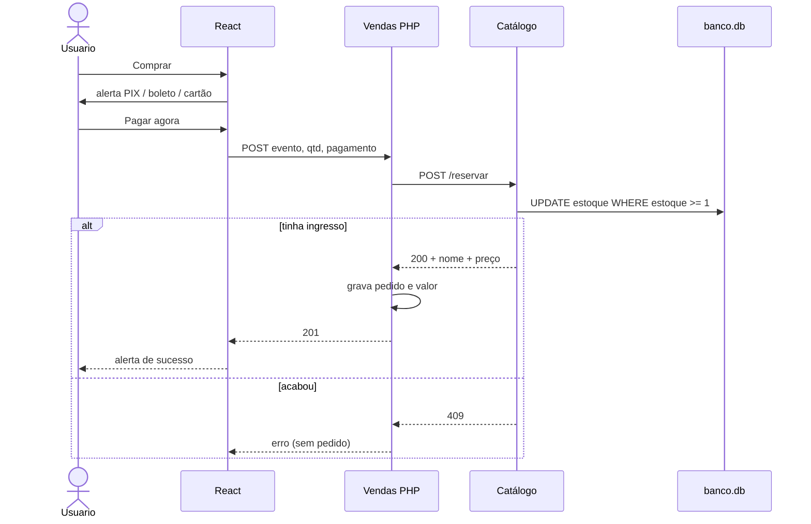
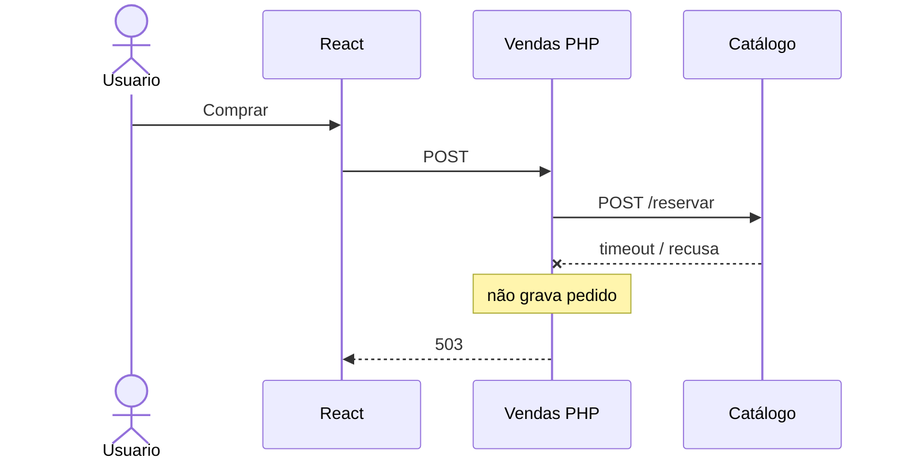

# IngressoCerto

Venda simples de ingressos. Três serviços separados, como o desafio pediu:

| Pasta | Stack | Papel |
| --- | --- | --- |
| `frontend/` | React + Vite + Tailwind | Tela: lista os shows e o botão comprar |
| `vendas/` | PHP | Caixa: recebe a compra, reserva no catálogo, grava o pedido |
| `catalogo/` | Python (Flask) | Estoque: eventos e quantidade disponível |

A compra **não** fala com o Catálogo direto. O React chama o PHP. O PHP chama o Python. Só grava venda se a reserva der certo.

## Diagrama

[Abrir no Excalidraw](https://excalidraw.com/#json=ojOmlmuhs7Ehk73BnMhAW,WuXzVFgwFLqSmQqf9lYxqw)


---

## Como rodar

Três terminais. Ordem: Catálogo → Vendas → tela.

**Catálogo** (porta 5000)

```bash
cd catalogo
python3 -m venv .venv
source .venv/bin/activate
pip install -r requirements.txt
python app.py
```

**Vendas** (porta 8000)

```bash
cd vendas
php -S 127.0.0.1:8000
```

**Frontend** (porta 5173)

```bash
cd frontend
npm install
npm run dev
```

Abre [http://127.0.0.1:5173](http://127.0.0.1:5173).

Documentação das APIs (Swagger): [http://127.0.0.1:5000/docs](http://127.0.0.1:5000/docs).

O PHP desta máquina não tinha `pdo_sqlite`, então o pedido vai para `vendas/vendas.json`. O estoque continua no SQLite do Catálogo (`catalogo/banco.db`).

---

## Arquitetura

Dois bancos. Estoque no Python. Pedido no PHP.

```
                 GET /eventos
Pessoa → React ──────────────────────────► Catálogo (Python)
            │                                    │
            │ POST compra                        │
            ▼                                    ▼
      Vendas (PHP) ── POST /reservar ──►    banco.db
            │                               (estoque)
            ▼
     vendas.json
      (pedidos)
```



- `GET /eventos` lista show, estoque e **preço**. Só leitura.
- `POST /reservar` baixa ingresso com um `UPDATE ... WHERE estoque >= 1`. Dois cliques no último lugar: um passa, o outro toma 409.
- O React nunca chama `/reservar`.
- A compra só segue depois do alerta de pagamento: PIX, boleto ou cartão.

---

## Fluxo da compra (explicação simples)

A pessoa está na tela. Ela precisa saber **agora** se o lugar é dela. Por isso a compra é **síncrona**: o PHP chama o Python e espera.

1. Clica em **Comprar**. Ainda **não** vende. Abre o alerta: PIX, boleto ou cartão, com o preço.
2. Clica em **Pagar agora**. O React manda um POST **só para o PHP** (evento, quantidade 1, forma de pagamento).
3. O PHP chama o Python em `/reservar` e espera.
4. O Python baixa o estoque numa query só (`estoque >= 1`). Dois cliques no último ingresso: um passa, o outro toma 409.
5. Se deu certo, o PHP grava o pedido com **valor** e **forma**. Se acabou o estoque, **não** grava.
6. A tela mostra o alerta verde (show, valor real, PIX/boleto/cartão, número do pedido) e o estoque no card desce.

Clicar não vende. Pagar vende. Quem confirma estoque é o Python. Quem grava o negócio é o PHP.



**Síncrono:** simples, resposta na hora, só confirma se o estoque baixou.  
**Contra:** se o Python atrasar, o usuário espera. Fila eu usaria para e-mail, não para confirmar ingresso.

---

## APIs

O frontend **só precisa** da lista de eventos e da compra. Reservar estoque é interno (PHP → Python).

### GET `http://127.0.0.1:5000/eventos`

Lista os shows. Sem corpo.

Resposta `200`:

```json
[
  { "id": 1, "nome": "Show do Silva", "estoque": 50, "preco": 180 }
]
```

| Campo | Tipo | O que é |
| --- | --- | --- |
| `id` | número | ID do evento |
| `nome` | texto | Nome do show |
| `estoque` | número | Quantos ainda tem |
| `preco` | número | Valor de 1 ingresso (R$) |

### POST `http://127.0.0.1:8000/index.php`

Compra. O React manda JSON.

Enviar:

```json
{
  "evento_id": 1,
  "quantidade": 1,
  "pagamento": "pix"
}
```

| Campo | Tipo | Obrigatório | Valores |
| --- | --- | --- | --- |
| `evento_id` | número | sim | ID que veio do GET |
| `quantidade` | número | sim | 1 ou mais |
| `pagamento` | texto | sim | `pix`, `boleto` ou `cartao` |

Resposta `201` (deu certo):

```json
{
  "ok": true,
  "venda_id": 19,
  "evento_id": 1,
  "nome": "Show do Silva",
  "quantidade": 1,
  "preco": 180,
  "total": 180,
  "pagamento": "pix",
  "pagamento_nome": "PIX"
}
```

Erros:

| HTTP | Quando |
| --- | --- |
| 400 | Faltou campo ou pagamento inválido |
| 409 | Estoque insuficiente |
| 503 | Catálogo fora do ar (não grava venda) |

`POST /reservar` no Python **não** é API de frontend. Só o PHP chama.

---

## Perguntas do desafio

### Documentação

O frontend precisa saber exatamente o que mandar. Por isso tem o Swagger em [http://127.0.0.1:5000/docs](http://127.0.0.1:5000/docs).

Lá está: URL, campo, tipo, exemplo e erro.

Se não tiver isso, um manda texto, outro manda número, a API quebra.

Neste projeto o React usa duas rotas: listar eventos e comprar. Reservar estoque é interno. O time de tela não mexe nisso.

Por quê: contrato evita chute. `/reservar` interno reduz erro e furo de segurança.

---

### Segurança

Ninguém pode baixar estoque sem pagar.

Se a rota de reservar ficar pública, qualquer um tira ingresso no Postman e a empresa não recebe.

Por isso o React não chama o Python. Ele chama o PHP, depois que a pessoa escolhe PIX, boleto ou cartão.

Cada um guarda o que é dele: tela no React, pedido no PHP, estoque no Python.

Hoje isso é o desenho da demo. Em produção: Catálogo na rede interna, chave entre PHP e Python, HTTPS, CORS só do site, pagamento confirmado no gateway. O React nunca recebe essa chave.

---

### Escalabilidade

Milhares ao mesmo tempo: quem mais sofre é o Catálogo. O estoque é um número só.

Por quê: cada venda precisa atualizar esse número. Não dá para ter duas verdades. Vários PHP ao mesmo tempo todos batem no mesmo estoque.

O PHP eu coloco mais de um, atrás de um balanceador. A página eu coloco em cache.

Por quê: o caixa não guarda o estoque. Só recebe o pedido e chama o Catálogo. Mais PHP = mais gente no caixa. A lista de eventos muda pouco, então a página pode ir no cache. O estoque, não.

O que eu **não** coloco em cache é o estoque na hora de vender. Senão vendo ingresso que não existe.

Por quê: cache é cópia atrasada. A tela pode mostrar 5. No banco já é 0. Se eu vender com o número da tela, vendo o que não tem.

Quem chegar depois do último lugar ouve esgotou. Isso é certo.

Por quê: o show tem 100 cadeiras, não 101. O `409` não é falha. É a regra.

---

### Extra

Se uma função está lenta, eu não saio mudando no achismo. Primeiro eu meço onde trava.

Pode ser query, pode ser rede, pode ser lock.

Aí sim eu corrijo.

Se o travamento for o último ingresso, eu não tiro essa trava. Duas pessoas não podem ficar com o mesmo lugar.

Por quê: Redis no escuro mascara o problema. Lock no último ingresso é regra, não bug.

---

## Se o Catálogo cair

No enunciado aparece “catálogo (PHP)”. O estoque é **Python**. Se ele estiver fora:

- o PHP não grava venda
- responde **503**
- o React mostra para tentar de novo

Não vendo “na confiança”. Sem estoque confirmado, não existe pedido.



---

## Pastas

```
catalogo/    API Flask + banco.db
vendas/      API PHP + vendas.json
frontend/    React
```
