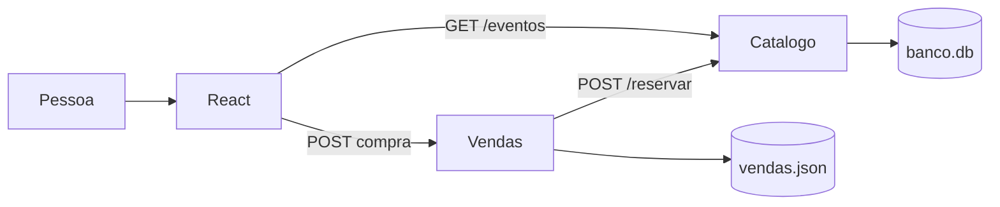
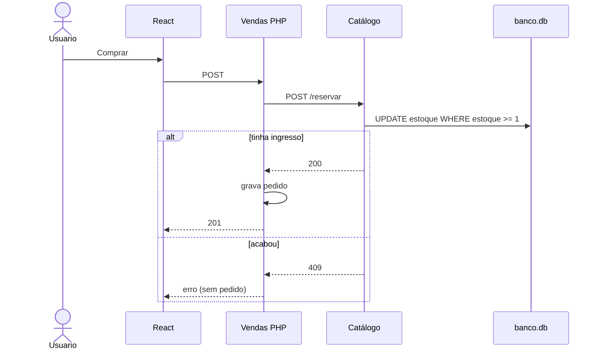
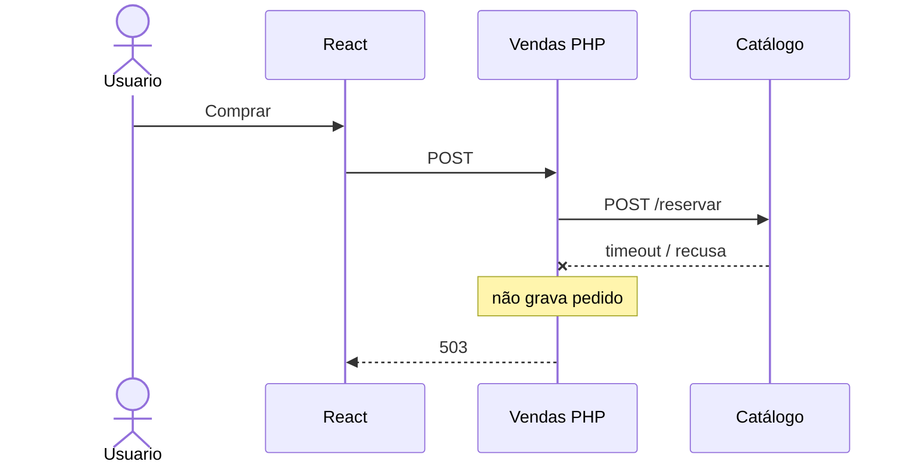

# IngressoCerto

Venda simples de ingressos. Três serviços separados, como o desafio pediu:

| Pasta | Stack | Papel |
| --- | --- | --- |
| `frontend/` | React + Vite + Tailwind | Tela: lista os shows e o botão comprar |
| `vendas/` | PHP | Caixa: recebe a compra, reserva no catálogo, grava o pedido |
| `catalogo/` | Python (Flask) | Estoque: eventos e quantidade disponível |

A compra **não** fala com o Catálogo direto. O React chama o PHP. O PHP chama o Python. Só grava venda se a reserva der certo.

## Diagrama

[Abrir no Excalidraw](https://excalidraw.com/#json=ojOmlmuhs7Ehk73BnMhAW,WuXzVFgwFLqSmQqf9lYxqw)


---

## Como rodar

Três terminais. Ordem: Catálogo → Vendas → tela.

**Catálogo** (porta 5000)

```bash
cd catalogo
python3 -m venv .venv
source .venv/bin/activate
pip install -r requirements.txt
python app.py
```

**Vendas** (porta 8000)

```bash
cd vendas
php -S 127.0.0.1:8000
```

**Frontend** (porta 5173)

```bash
cd frontend
npm install
npm run dev
```

Abre [http://127.0.0.1:5173](http://127.0.0.1:5173).

O PHP desta máquina não tinha `pdo_sqlite`, então o pedido vai para `vendas/vendas.json`. O estoque continua no SQLite do Catálogo (`catalogo/banco.db`).

---

## Arquitetura

Dois bancos. Estoque no Python. Pedido no PHP.

```
                 GET /eventos
Pessoa → React ──────────────────────────► Catálogo (Python)
            │                                    │
            │ POST compra                        │
            ▼                                    ▼
      Vendas (PHP) ── POST /reservar ──►    banco.db
            │                               (estoque)
            ▼
     vendas.json
      (pedidos)
```



- `GET /eventos` só lista. Não mexe em estoque.
- `POST /reservar` baixa ingresso com um `UPDATE ... WHERE estoque >= 1`. Dois cliques no último lugar: um passa, o outro toma 409.
- O React nunca chama `/reservar`.

---

## Fluxo da compra

Tudo **síncrono** (HTTP e espera). A pessoa está na tela e precisa saber se o lugar é dela. Fila eu deixaria para e-mail ou nota, não para confirmar ingresso.

1. Clica em Comprar.
2. React manda `POST` para o PHP (`evento_id`, `quantidade: 1`) e mostra carregando.
3. PHP chama `POST /reservar` no Python e espera.
4. Python tenta baixar o estoque na mesma query.
5. Se deu 200, o PHP grava o pedido e responde 201. Se deu 409, não grava.
6. React tira o carregando e mostra sucesso ou erro. O número na tela desce.



**Síncrono:** simples, resposta na hora, só confirma se o estoque baixou.  
**Contra:** se o Python atrasar, o usuário espera.

---

## Se o Catálogo cair

No enunciado aparece “catálogo (PHP)”. O estoque é **Python**. Se ele estiver fora:

- o PHP não grava venda
- responde **503**
- o React mostra para tentar de novo

Não vendo “na confiança”. Sem estoque confirmado, não existe pedido.



---

## Pastas

```
catalogo/    API Flask + banco.db
vendas/      API PHP + vendas.json
frontend/    React
```
