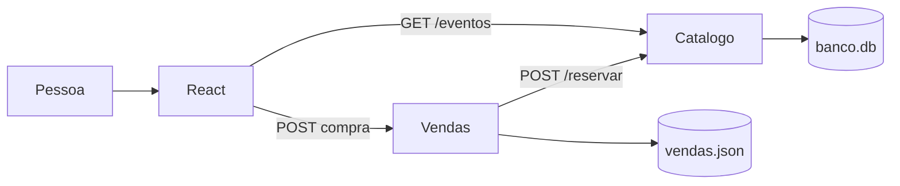
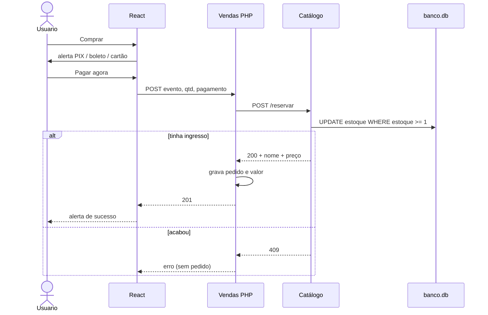
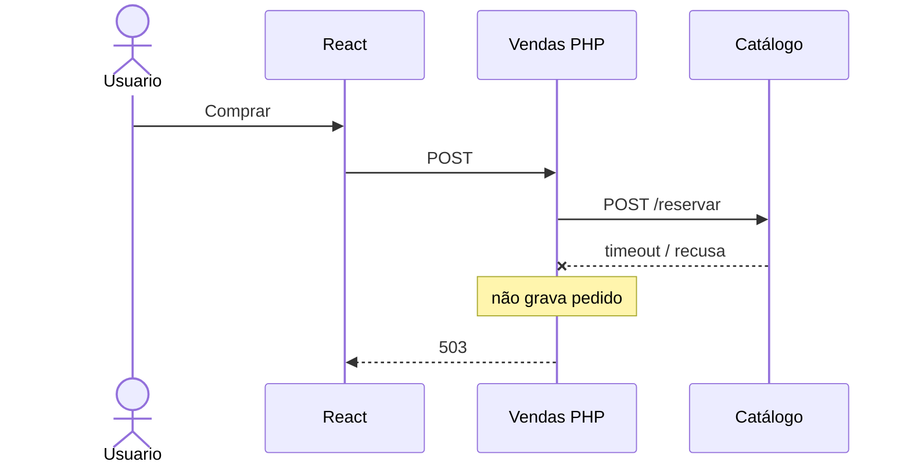

# IngressoCerto

Venda simples de ingressos. Três serviços separados, como o desafio pediu:

| Pasta | Stack | Papel |
| --- | --- | --- |
| `frontend/` | React + Vite + Tailwind | Tela: lista os shows e o botão comprar |
| `vendas/` | PHP | Caixa: recebe a compra, reserva no catálogo, grava o pedido |
| `catalogo/` | Python (Flask) | Estoque: eventos e quantidade disponível |

A compra **não** fala com o Catálogo direto. O React chama o PHP. O PHP chama o Python. Só grava venda se a reserva der certo.

## Diagrama

[Abrir no Excalidraw](https://excalidraw.com/#json=ojOmlmuhs7Ehk73BnMhAW,WuXzVFgwFLqSmQqf9lYxqw)


---

## Como rodar

Três terminais. Ordem: Catálogo → Vendas → tela.

**Catálogo** (porta 5000)

```bash
cd catalogo
python3 -m venv .venv
source .venv/bin/activate
pip install -r requirements.txt
python app.py
```

**Vendas** (porta 8000)

```bash
cd vendas
php -S 127.0.0.1:8000
```

**Frontend** (porta 5173)

```bash
cd frontend
npm install
npm run dev
```

Abre [http://127.0.0.1:5173](http://127.0.0.1:5173).

O PHP desta máquina não tinha `pdo_sqlite`, então o pedido vai para `vendas/vendas.json`. O estoque continua no SQLite do Catálogo (`catalogo/banco.db`).

---

## Arquitetura

Dois bancos. Estoque no Python. Pedido no PHP.

```
                 GET /eventos
Pessoa → React ──────────────────────────► Catálogo (Python)
            │                                    │
            │ POST compra                        │
            ▼                                    ▼
      Vendas (PHP) ── POST /reservar ──►    banco.db
            │                               (estoque)
            ▼
     vendas.json
      (pedidos)
```



- `GET /eventos` lista show, estoque e **preço**. Só leitura.
- `POST /reservar` baixa ingresso com um `UPDATE ... WHERE estoque >= 1`. Dois cliques no último lugar: um passa, o outro toma 409.
- O React nunca chama `/reservar`.
- A compra só segue depois do alerta de pagamento: PIX, boleto ou cartão.

---

## Fluxo da compra (explicação simples)

A pessoa está na tela. Ela precisa saber **agora** se o lugar é dela. Por isso a compra é **síncrona**: o PHP chama o Python e espera.

1. Clica em **Comprar**. Ainda **não** vende. Abre o alerta: PIX, boleto ou cartão, com o preço.
2. Clica em **Pagar agora**. O React manda um POST **só para o PHP** (evento, quantidade 1, forma de pagamento).
3. O PHP chama o Python em `/reservar` e espera.
4. O Python baixa o estoque numa query só (`estoque >= 1`). Dois cliques no último ingresso: um passa, o outro toma 409.
5. Se deu certo, o PHP grava o pedido com **valor** e **forma**. Se acabou o estoque, **não** grava.
6. A tela mostra o alerta verde (show, valor real, PIX/boleto/cartão, número do pedido) e o estoque no card desce.

Clicar não vende. Pagar vende. Quem confirma estoque é o Python. Quem grava o negócio é o PHP.



**Síncrono:** simples, resposta na hora, só confirma se o estoque baixou.  
**Contra:** se o Python atrasar, o usuário espera. Fila eu usaria para e-mail, não para confirmar ingresso.

---

## APIs

O frontend **só precisa** da lista de eventos e da compra. Reservar estoque é interno (PHP → Python).

### GET `http://127.0.0.1:5000/eventos`

Lista os shows. Sem corpo.

Resposta `200`:

```json
[
  { "id": 1, "nome": "Show do Silva", "estoque": 50, "preco": 180 }
]
```

| Campo | Tipo | O que é |
| --- | --- | --- |
| `id` | número | ID do evento |
| `nome` | texto | Nome do show |
| `estoque` | número | Quantos ainda tem |
| `preco` | número | Valor de 1 ingresso (R$) |

### POST `http://127.0.0.1:8000/index.php`

Compra. O React manda JSON.

Enviar:

```json
{
  "evento_id": 1,
  "quantidade": 1,
  "pagamento": "pix"
}
```

| Campo | Tipo | Obrigatório | Valores |
| --- | --- | --- | --- |
| `evento_id` | número | sim | ID que veio do GET |
| `quantidade` | número | sim | 1 ou mais |
| `pagamento` | texto | sim | `pix`, `boleto` ou `cartao` |

Resposta `201` (deu certo):

```json
{
  "ok": true,
  "venda_id": 19,
  "evento_id": 1,
  "nome": "Show do Silva",
  "quantidade": 1,
  "preco": 180,
  "total": 180,
  "pagamento": "pix",
  "pagamento_nome": "PIX"
}
```

Erros:

| HTTP | Quando |
| --- | --- |
| 400 | Faltou campo ou pagamento inválido |
| 409 | Estoque insuficiente |
| 503 | Catálogo fora do ar (não grava venda) |

`POST /reservar` no Python **não** é API de frontend. Só o PHP chama.

---

## Perguntas do desafio

### Documentação

Documentaria a API de **Vendas** (e o GET de eventos) num contrato OpenAPI/Swagger: URL, método, campos, tipo, exemplo e código de erro. O frontend não adivinha se `evento_id` é número ou se `pagamento` é `pix` ou `PIX`.

Na prática: “para comprar você manda isto; recebe aquilo; se acabou o estoque vem 409.” O time de tela **não** precisa da rota de reservar estoque.

### Segurança

Ninguém da internet deveria chamar o Python e baixar estoque sem pagar.

- O React **não** chama `/reservar`. Só o PHP chama, na rede interna.
- Sem `pagamento` válido, a compra nem segue.
- Catálogo não é público. PHP e Python se reconhecem (na demo está aberto; em produção: API key ou token de serviço).
- Dados separados: estoque e preço no Catálogo; pedido, valor pago e forma no PHP. Cartão de verdade nem entra neste projeto (a demo só registra a escolha).

Frase: o frontend nunca baixa estoque; quem baixa é o serviço que também registra o pagamento.

### Escalabilidade

Show enorme, milhares no mesmo segundo.

Quem mais sofre: **Catálogo** — todo mundo disputa o mesmo número de estoque. Depois o **PHP** (cada clique vira pedido). A página do evento escala mais fácil (cache, CDN).

Sugestão: vários PHP atrás de um load balancer; Catálogo com o `UPDATE` atômico (não vender com cache de estoque); cache só para **ler** o show (nome, preço da vitrine); rate limit no botão. No último ingresso, parte das pessoas vai ouvir “esgotou”. O sistema está sendo honesto.

### Extra (gargalo)

Não otimizo no achismo. Meço: tempo da request, query lenta, lock, chamada HTTP.

Aí sim: índice, parar de N+1, cache de leitura, pool de conexão. Se o gargalo for o `UPDATE` do último ingresso, é esperado: duas pessoas não podem levar o mesmo lugar. A melhoria não é “tirar o lock”; é deixar a fila na **entrada** da página, não vender no escuro.

---

## Se o Catálogo cair

No enunciado aparece “catálogo (PHP)”. O estoque é **Python**. Se ele estiver fora:

- o PHP não grava venda
- responde **503**
- o React mostra para tentar de novo

Não vendo “na confiança”. Sem estoque confirmado, não existe pedido.



---

## Pastas

```
catalogo/    API Flask + banco.db
vendas/      API PHP + vendas.json
frontend/    React
```
